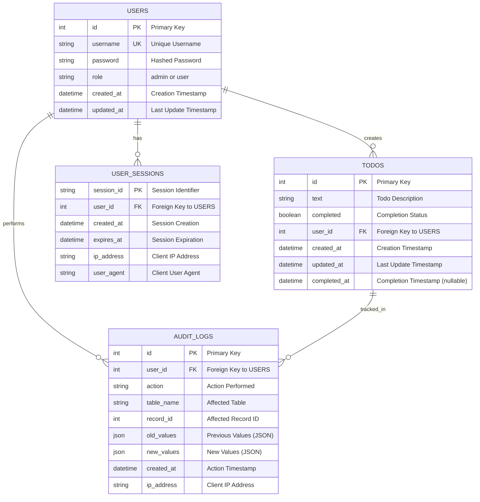
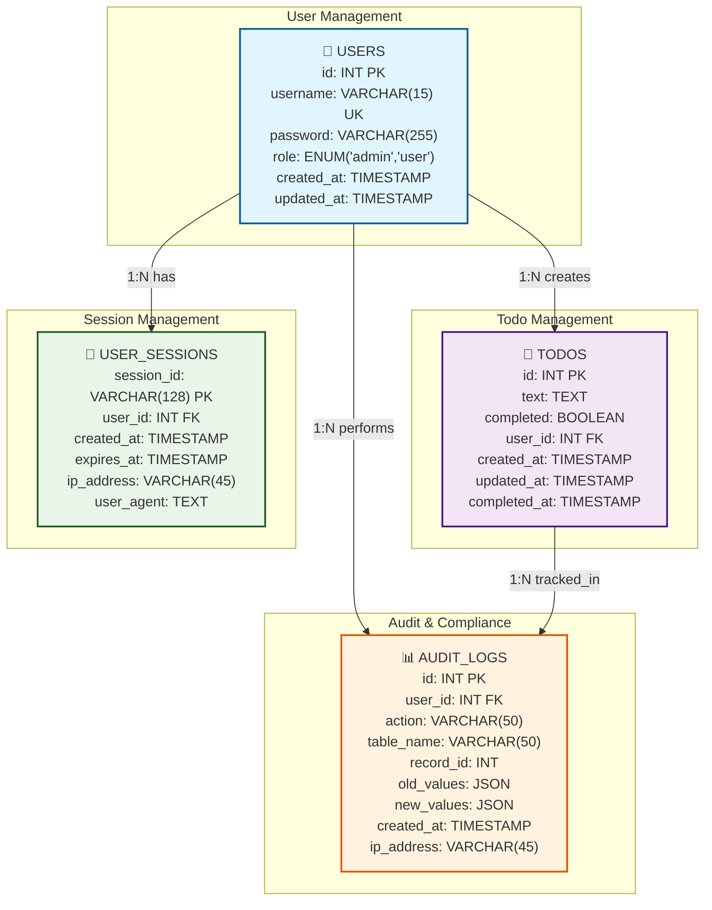

# Entity Relationship Diagram (ERD) - Team To-Do List Application

## 📊 Visual ERD

> **Note**: The diagrams below are in Mermaid format. To view them as visual diagrams, use GitHub, VS Code with Mermaid extension, or online tools like mermaid.live

## 📋 Quick ASCII Diagram (Immediate View)

```
┌─────────────────┐    ┌─────────────────┐    ┌─────────────────┐
│   👤 USERS      │    │  📝 TODOS       │    │ 🔐 SESSIONS     │
├─────────────────┤    ├─────────────────┤    ├─────────────────┤
│ id (PK)         │    │ id (PK)         │    │ session_id (PK) │
│ username (UK)   │    │ text            │    │ user_id (FK)    │
│ password        │    │ completed       │    │ created_at      │
│ role            │    │ user_id (FK)    │    │ expires_at      │
│ created_at      │    │ created_at      │    │ ip_address      │
│ updated_at      │    │ updated_at      │    │ user_agent      │
│                 │    │ completed_at    │    │                 │
└─────────────────┘    └─────────────────┘    └─────────────────┘
         │                       │                       │
         │ 1:N                   │ 1:N                   │ 1:N
         │ creates               │ tracked_in            │ has
         ▼                       ▼                       ▼
┌─────────────────┐    ┌─────────────────┐    ┌─────────────────┐
│  📊 AUDIT_LOGS  │    │  📊 AUDIT_LOGS  │    │  📊 AUDIT_LOGS  │
├─────────────────┤    ├─────────────────┤    ├─────────────────┤
│ id (PK)         │    │ id (PK)         │    │ id (PK)         │
│ user_id (FK)    │    │ user_id (FK)    │    │ user_id (FK)    │
│ action          │    │ action          │    │ action          │
│ table_name      │    │ table_name      │    │ table_name      │
│ record_id       │    │ record_id       │    │ record_id       │
│ old_values      │    │ old_values      │    │ old_values      │
│ new_values      │    │ new_values      │    │ new_values      │
│ created_at      │    │ created_at      │    │ created_at      │
│ ip_address      │    │ ip_address      │    │ ip_address      │
└─────────────────┘    └─────────────────┘    └─────────────────┘
```

**Legend:**
- **PK** = Primary Key
- **FK** = Foreign Key  
- **UK** = Unique Key
- **1:N** = One-to-Many relationship



## 🎨 Visual Database Schema Diagram



## 🗄️ Database Schema

### **USERS Table**
```sql
CREATE TABLE users (
    id INT PRIMARY KEY AUTO_INCREMENT,
    username VARCHAR(15) NOT NULL UNIQUE,
    password VARCHAR(255) NOT NULL,
    role ENUM('admin', 'user') NOT NULL DEFAULT 'user',
    created_at TIMESTAMP DEFAULT CURRENT_TIMESTAMP,
    updated_at TIMESTAMP DEFAULT CURRENT_TIMESTAMP ON UPDATE CURRENT_TIMESTAMP,
    
    -- Constraints
    CONSTRAINT chk_username_length CHECK (CHAR_LENGTH(username) >= 1 AND CHAR_LENGTH(username) <= 15),
    CONSTRAINT chk_username_alphanumeric CHECK (username REGEXP '^[a-zA-Z0-9]+$'),
    CONSTRAINT chk_password_not_empty CHECK (CHAR_LENGTH(password) > 0)
);

-- Indexes
CREATE INDEX idx_users_username ON users(username);
CREATE INDEX idx_users_role ON users(role);
CREATE INDEX idx_users_created_at ON users(created_at);
```

### **TODOS Table**
```sql
CREATE TABLE todos (
    id INT PRIMARY KEY AUTO_INCREMENT,
    text TEXT NOT NULL,
    completed BOOLEAN NOT NULL DEFAULT FALSE,
    user_id INT NOT NULL,
    created_at TIMESTAMP DEFAULT CURRENT_TIMESTAMP,
    updated_at TIMESTAMP DEFAULT CURRENT_TIMESTAMP ON UPDATE CURRENT_TIMESTAMP,
    completed_at TIMESTAMP NULL,
    
    -- Foreign Key
    FOREIGN KEY (user_id) REFERENCES users(id) ON DELETE CASCADE,
    
    -- Constraints
    CONSTRAINT chk_text_not_empty CHECK (CHAR_LENGTH(TRIM(text)) > 0),
    CONSTRAINT chk_completed_at_logic CHECK (
        (completed = TRUE AND completed_at IS NOT NULL) OR 
        (completed = FALSE AND completed_at IS NULL)
    )
);

-- Indexes
CREATE INDEX idx_todos_user_id ON todos(user_id);
CREATE INDEX idx_todos_completed ON todos(completed);
CREATE INDEX idx_todos_created_at ON todos(created_at);
CREATE INDEX idx_todos_completed_at ON todos(completed_at);
CREATE INDEX idx_todos_user_completed ON todos(user_id, completed);
```

### **USER_SESSIONS Table**
```sql
CREATE TABLE user_sessions (
    session_id VARCHAR(128) PRIMARY KEY,
    user_id INT NOT NULL,
    created_at TIMESTAMP DEFAULT CURRENT_TIMESTAMP,
    expires_at TIMESTAMP NOT NULL,
    ip_address VARCHAR(45),
    user_agent TEXT,
    
    -- Foreign Key
    FOREIGN KEY (user_id) REFERENCES users(id) ON DELETE CASCADE,
    
    -- Constraints
    CONSTRAINT chk_expires_future CHECK (expires_at > created_at)
);

-- Indexes
CREATE INDEX idx_sessions_user_id ON user_sessions(user_id);
CREATE INDEX idx_sessions_expires_at ON user_sessions(expires_at);
CREATE INDEX idx_sessions_created_at ON user_sessions(created_at);
```

### **AUDIT_LOGS Table**
```sql
CREATE TABLE audit_logs (
    id INT PRIMARY KEY AUTO_INCREMENT,
    user_id INT NOT NULL,
    action VARCHAR(50) NOT NULL,
    table_name VARCHAR(50) NOT NULL,
    record_id INT,
    old_values JSON,
    new_values JSON,
    created_at TIMESTAMP DEFAULT CURRENT_TIMESTAMP,
    ip_address VARCHAR(45),
    
    -- Foreign Key
    FOREIGN KEY (user_id) REFERENCES users(id) ON DELETE CASCADE,
    
    -- Constraints
    CONSTRAINT chk_action_not_empty CHECK (CHAR_LENGTH(TRIM(action)) > 0),
    CONSTRAINT chk_table_name_not_empty CHECK (CHAR_LENGTH(TRIM(table_name)) > 0)
);

-- Indexes
CREATE INDEX idx_audit_user_id ON audit_logs(user_id);
CREATE INDEX idx_audit_action ON audit_logs(action);
CREATE INDEX idx_audit_table_name ON audit_logs(table_name);
CREATE INDEX idx_audit_created_at ON audit_logs(created_at);
CREATE INDEX idx_audit_user_action ON audit_logs(user_id, action);
```

## 🔗 Entity Relationships

### **Primary Relationships**

| Relationship | Type | Description | Foreign Key |
|--------------|------|-------------|-------------|
| **USERS → TODOS** | 1:N | One user creates many todos | `todos.user_id → users.id` |
| **USERS → USER_SESSIONS** | 1:N | One user has multiple sessions | `user_sessions.user_id → users.id` |
| **USERS → AUDIT_LOGS** | 1:N | One user performs many actions | `audit_logs.user_id → users.id` |
| **TODOS → AUDIT_LOGS** | 1:N | One todo tracked in multiple logs | `audit_logs.record_id` |

### **Cardinality Rules**

- **USERS (1) → TODOS (N)**: A user can create zero or many todos
- **USERS (1) → USER_SESSIONS (N)**: A user can have zero or many active sessions
- **USERS (1) → AUDIT_LOGS (N)**: A user can perform zero or many actions
- **TODOS (1) → AUDIT_LOGS (N)**: A todo can be tracked in zero or many audit logs

## 📋 Entity Descriptions

### **USERS Entity**
**Purpose**: Store user account information and role-based access control

**Attributes**:
- `id`: Primary key, auto-incrementing integer
- `username`: Unique identifier, 1-15 characters, alphanumeric only
- `password`: Hashed password for authentication
- `role`: User role ('admin' or 'user') for access control
- `created_at`: Account creation timestamp
- `updated_at`: Last modification timestamp

**Business Rules**:
- Username must be unique across all users
- Username must be 1-15 characters, alphanumeric only
- Password must be hashed (not stored in plain text)
- Role must be either 'admin' or 'user'
- At least one admin user must always exist

### **TODOS Entity**
**Purpose**: Store todo items with user assignment and completion tracking

**Attributes**:
- `id`: Primary key, auto-incrementing integer
- `text`: Todo description/content
- `completed`: Boolean flag for completion status
- `user_id`: Foreign key to USERS table
- `created_at`: Todo creation timestamp
- `updated_at`: Last modification timestamp
- `completed_at`: Completion timestamp (nullable)

**Business Rules**:
- Todo text cannot be empty or whitespace only
- Todo must belong to a valid user
- Completed todos must have a completion timestamp
- Incomplete todos cannot have a completion timestamp
- When user is deleted, all their todos are deleted (CASCADE)

### **USER_SESSIONS Entity**
**Purpose**: Manage user authentication sessions for security

**Attributes**:
- `session_id`: Primary key, unique session identifier
- `user_id`: Foreign key to USERS table
- `created_at`: Session creation timestamp
- `expires_at`: Session expiration timestamp
- `ip_address`: Client IP address for security tracking
- `user_agent`: Client browser information

**Business Rules**:
- Session expiration must be in the future
- Sessions are automatically cleaned up on expiration
- User can have multiple concurrent sessions
- When user is deleted, all their sessions are deleted (CASCADE)

### **AUDIT_LOGS Entity**
**Purpose**: Track all user actions for security, compliance, and debugging

**Attributes**:
- `id`: Primary key, auto-incrementing integer
- `user_id`: Foreign key to USERS table
- `action`: Action performed (CREATE, UPDATE, DELETE, LOGIN, etc.)
- `table_name`: Affected table name
- `record_id`: ID of the affected record
- `old_values`: Previous values as JSON (for updates/deletes)
- `new_values`: New values as JSON (for creates/updates)
- `created_at`: Action timestamp
- `ip_address`: Client IP address for security

**Business Rules**:
- All user actions must be logged
- Old and new values stored as JSON for flexibility
- Audit logs are immutable once created
- IP address tracked for security purposes
- When user is deleted, their audit logs are preserved (for compliance)

## 🔍 Key Constraints & Validations

### **Data Integrity Constraints**

| Table | Constraint | Description |
|-------|------------|-------------|
| **USERS** | `chk_username_length` | Username must be 1-15 characters |
| **USERS** | `chk_username_alphanumeric` | Username must be alphanumeric only |
| **USERS** | `chk_password_not_empty` | Password cannot be empty |
| **TODOS** | `chk_text_not_empty` | Todo text cannot be empty/whitespace |
| **TODOS** | `chk_completed_at_logic` | Completion timestamp logic validation |
| **USER_SESSIONS** | `chk_expires_future` | Session expiration must be in future |
| **AUDIT_LOGS** | `chk_action_not_empty` | Action cannot be empty |
| **AUDIT_LOGS** | `chk_table_name_not_empty` | Table name cannot be empty |

### **Referential Integrity**

| Foreign Key | References | On Delete | On Update |
|-------------|------------|-----------|-----------|
| `todos.user_id` | `users.id` | CASCADE | CASCADE |
| `user_sessions.user_id` | `users.id` | CASCADE | CASCADE |
| `audit_logs.user_id` | `users.id` | CASCADE | CASCADE |

## 📊 Sample Data Relationships

### **Sample Users**
```sql
INSERT INTO users (username, password, role) VALUES
('admin', '$2a$10$N9qo8uLOickgx2ZMRZoMye', 'admin'),
('alice', '$2a$10$N9qo8uLOickgx2ZMRZoMye', 'user'),
('bob', '$2a$10$N9qo8uLOickgx2ZMRZoMye', 'user');
```

### **Sample Todos**
```sql
INSERT INTO todos (text, completed, user_id, created_at, completed_at) VALUES
('Review project requirements', FALSE, 2, '2024-01-15 09:00:00', NULL),
('Design database schema', TRUE, 2, '2024-01-15 10:30:00', '2024-01-15 14:20:00'),
('Implement user authentication', FALSE, 1, '2024-01-15 11:15:00', NULL),
('Create todo management API', FALSE, 3, '2024-01-15 12:00:00', NULL);
```

### **Sample Sessions**
```sql
INSERT INTO user_sessions (session_id, user_id, created_at, expires_at, ip_address) VALUES
('sess_abc123', 1, '2024-01-15 08:00:00', '2024-01-15 20:00:00', '192.168.1.100'),
('sess_def456', 2, '2024-01-15 09:30:00', '2024-01-15 21:30:00', '192.168.1.101');
```

### **Sample Audit Logs**
```sql
INSERT INTO audit_logs (user_id, action, table_name, record_id, new_values, created_at, ip_address) VALUES
(1, 'LOGIN', 'users', 1, '{"username": "admin"}', '2024-01-15 08:00:00', '192.168.1.100'),
(2, 'CREATE', 'todos', 1, '{"text": "Review project requirements", "user_id": 2}', '2024-01-15 09:00:00', '192.168.1.101'),
(2, 'UPDATE', 'todos', 2, '{"completed": true, "completed_at": "2024-01-15 14:20:00"}', '2024-01-15 14:20:00', '192.168.1.101');
```

## 🚀 Database Implementation Notes

### **Current State**
- Application currently uses **in-memory storage** (Go slices)
- No database connection required for current functionality
- All data is lost when server restarts

### **Future Database Integration**
- This ERD serves as the blueprint for database implementation
- Can be implemented with MySQL, PostgreSQL, or SQLite
- All relationships and constraints are production-ready
- Includes performance optimization with strategic indexing

### **Migration Benefits**
- **Data Persistence**: Data survives server restarts
- **Scalability**: Handle larger datasets efficiently
- **Security**: Enhanced data protection and audit trails
- **Performance**: Optimized queries with proper indexing
- **Compliance**: Complete audit trail for regulatory requirements

This ERD provides a complete database model that can be implemented when ready to move from in-memory storage to a persistent database solution.
