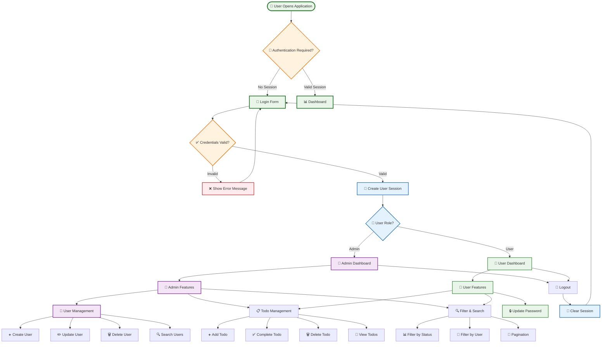
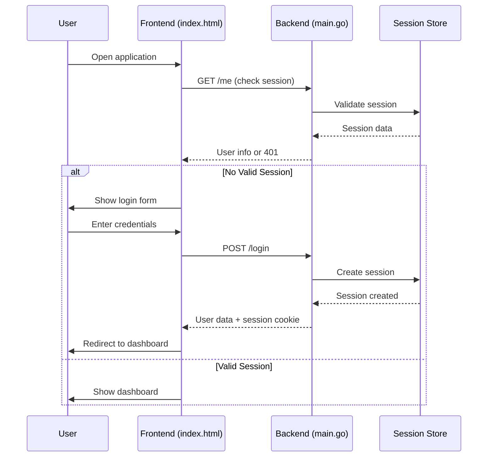
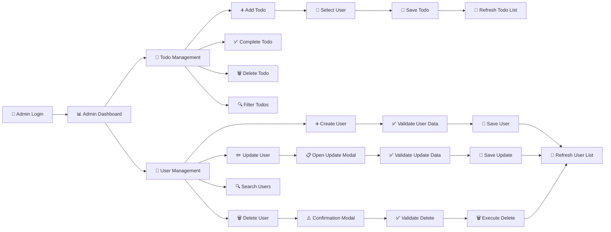
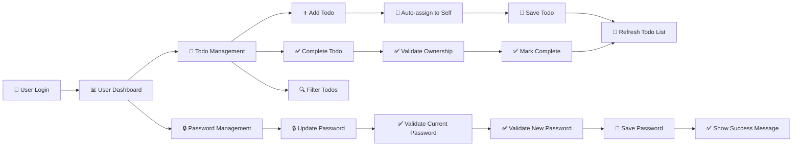
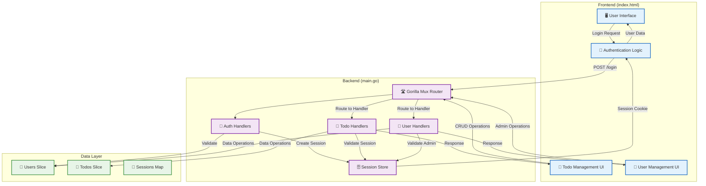
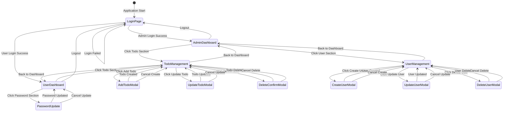
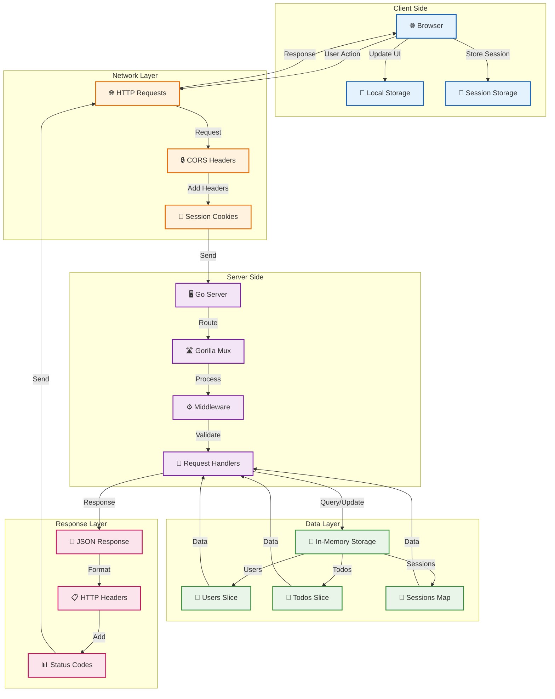

# End-to-End (E2E) Flow Diagram - Team To-Do List Application

> **Note**: The diagrams below are in Mermaid format. To view them as visual diagrams, use GitHub, VS Code with Mermaid extension, or online tools like mermaid.live

## 📋 Quick ASCII Flow Diagram (Immediate View)

```
┌─────────────────────────────────────────────────────────────────────────────────┐
│                           🚀 USER JOURNEY FLOW                                 │
└─────────────────────────────────────────────────────────────────────────────────┘

┌─────────────┐
│ 🚀 Start    │
└──────┬──────┘
       │
       ▼
┌─────────────┐    ┌─────────────┐    ┌─────────────┐
│ 🔐 Login    │───▶│ ✅ Valid?   │───▶│ 🔑 Create   │
│ Form        │    │ Credentials │    │ Session     │
└─────────────┘    └──────┬──────┘    └──────┬──────┘
       ▲                  │ No                │ Yes
       │                  ▼                  ▼
       │            ┌─────────────┐    ┌─────────────┐
       │            │ ❌ Show     │    │ 👤 User     │
       │            │ Error       │    │ Role?       │
       │            └─────────────┘    └──────┬──────┘
       │                                     │
       └─────────────────────────────────────┘
                                              │
                                              ▼
                                    ┌─────────────────┐
                                    │ 👑 Admin        │
                                    │ Dashboard       │
                                    └─────────┬───────┘
                                              │
                                              ▼
                                    ┌─────────────────┐
                                    │ 🔧 Admin        │
                                    │ Features        │
                                    └─────────┬───────┘
                                              │
                    ┌─────────────────────────┼─────────────────────────┐
                    │                         │                         │
                    ▼                         ▼                         ▼
            ┌─────────────┐          ┌─────────────┐          ┌─────────────┐
            │ 👥 User     │          │ 📝 Todo     │          │ 🔍 Filter   │
            │ Management  │          │ Management  │          │ & Search    │
            └─────────────┘          └─────────────┘          └─────────────┘
                    │                         │                         │
                    ▼                         ▼                         ▼
            ┌─────────────┐          ┌─────────────┐          ┌─────────────┐
            │ ➕ Create   │          │ ➕ Add      │          │ 📊 Filter   │
            │ User        │          │ Todo        │          │ by Status   │
            └─────────────┘          └─────────────┘          └─────────────┘
                    │                         │                         │
                    ▼                         ▼                         ▼
            ┌─────────────┐          ┌─────────────┐          ┌─────────────┐
            │ ✏️ Update   │          │ ✅ Complete │          │ 👤 Filter   │
            │ User        │          │ Todo        │          │ by User     │
            └─────────────┘          └─────────────┘          └─────────────┘
                    │                         │                         │
                    ▼                         ▼                         ▼
            ┌─────────────┐          ┌─────────────┐          ┌─────────────┐
            │ 🗑️ Delete   │          │ 🗑️ Delete   │          │ 📄 Pagination│
            │ User        │          │ Todo        │          │             │
            └─────────────┘          └─────────────┘          └─────────────┘

┌─────────────────────────────────────────────────────────────────────────────────┐
│                           👤 GENERAL USER FLOW                                 │
└─────────────────────────────────────────────────────────────────────────────────┘

┌─────────────┐
│ 👤 User     │
│ Login       │
└──────┬──────┘
       │
       ▼
┌─────────────┐
│ 📊 User     │
│ Dashboard   │
└──────┬──────┘
       │
       ▼
┌─────────────┐
│ 📝 Todo     │
│ Management  │
└──────┬──────┘
       │
       ▼
┌─────────────┐    ┌─────────────┐    ┌─────────────┐
│ ➕ Add      │    │ ✅ Complete │    │ 🔍 Filter   │
│ Todo        │    │ Todo        │    │ & Search    │
└─────────────┘    └─────────────┘    └─────────────┘
       │                  │                  │
       ▼                  ▼                  ▼
┌─────────────┐    ┌─────────────┐    ┌─────────────┐
│ 👤 Auto-    │    │ ✅ Validate │    │ 📊 Filter   │
│ assign to   │    │ Ownership   │    │ by Status   │
│ Self        │    │             │    │             │
└─────────────┘    └─────────────┘    └─────────────┘
       │                  │                  │
       ▼                  ▼                  ▼
┌─────────────┐    ┌─────────────┐    ┌─────────────┐
│ 💾 Save     │    │ ✅ Mark     │    │ 👤 Filter   │
│ Todo        │    │ Complete    │    │ by User     │
└─────────────┘    └─────────────┘    └─────────────┘

┌─────────────────────────────────────────────────────────────────────────────────┐
│                           🔄 API INTERACTION FLOW                              │
└─────────────────────────────────────────────────────────────────────────────────┘

┌─────────────┐    ┌─────────────┐    ┌─────────────┐    ┌─────────────┐
│ 🖥️ Frontend │───▶│ 🌐 HTTP     │───▶│ 🖥️ Go       │───▶│ 💾 Data     │
│ (index.html)│    │ Request     │    │ Server      │    │ Layer       │
└─────────────┘    └─────────────┘    └─────────────┘    └─────────────┘
       ▲                  ▲                  ▲                  │
       │                  │                  │                  ▼
       │                  │                  │            ┌─────────────┐
       │                  │                  │            │ 👤 Users    │
       │                  │                  │            │ Slice       │
       │                  │                  │            └─────────────┘
       │                  │                  │                  │
       │                  │                  │                  ▼
       │                  │                  │            ┌─────────────┐
       │                  │                  │            │ 📝 Todos    │
       │                  │                  │            │ Slice       │
       │                  │                  │            └─────────────┘
       │                  │                  │                  │
       │                  │                  │                  ▼
       │                  │                  │            ┌─────────────┐
       │                  │                  │            │ 🔑 Sessions │
       │                  │                  │            │ Map         │
       │                  │                  │            └─────────────┘
       │                  │                  │
       │                  │                  ▼
       │                  │            ┌─────────────┐
       │                  │            │ 📄 JSON     │
       │                  │            │ Response    │
       │                  │            └─────────────┘
       │                  │                  │
       │                  │                  ▼
       │                  │            ┌─────────────┐
       │                  │            │ 📋 HTTP     │
       │                  │            │ Headers     │
       │                  │            └─────────────┘
       │                  │                  │
       │                  │                  ▼
       │                  │            ┌─────────────┐
       │                  │            │ 📊 Status   │
       │                  │            │ Codes       │
       │                  │            └─────────────┘
       │                  │
       │                  ▼
       │            ┌─────────────┐
       │            │ 🌐 HTTP     │
       │            │ Response    │
       │            └─────────────┘
       │
       ▼
┌─────────────┐
│ 🔄 Update   │
│ UI          │
└─────────────┘

┌─────────────────────────────────────────────────────────────────────────────────┐
│                           🎯 KEY FLOW PATTERNS                                 │
└─────────────────────────────────────────────────────────────────────────────────┘

1. 🔐 AUTHENTICATION PATTERN
   ┌─────────────┐    ┌─────────────┐    ┌─────────────┐    ┌─────────────┐
   │ User Login  │───▶│ Validate    │───▶│ Create      │───▶│ Role-based  │
   │             │    │ Credentials │    │ Session     │    │ Dashboard   │
   └─────────────┘    └─────────────┘    └─────────────┘    └─────────────┘

2. 📝 CRUD OPERATIONS PATTERN
   ┌─────────────┐    ┌─────────────┐    ┌─────────────┐    ┌─────────────┐
   │ Frontend    │───▶│ Backend     │───▶│ Data        │───▶│ UI Update   │
   │ Validation  │    │ Validation  │    │ Operation   │    │ & Feedback  │
   └─────────────┘    └─────────────┘    └─────────────┘    └─────────────┘

3. 🔄 STATE MANAGEMENT PATTERN
   ┌─────────────┐    ┌─────────────┐    ┌─────────────┐    ┌─────────────┐
   │ User Action │───▶│ Update      │───▶│ Reactive    │───▶│ UI Refresh  │
   │             │    │ State       │    │ Updates     │    │             │
   └─────────────┘    └─────────────┘    └─────────────┘    └─────────────┘

4. ❌ ERROR HANDLING PATTERN
   ┌─────────────┐    ┌─────────────┐    ┌─────────────┐    ┌─────────────┐
   │ Error       │───▶│ Show Error  │───▶│ User        │───▶│ Retry/      │
   │ Occurs      │    │ Message     │    │ Correction  │    │ Continue    │
   └─────────────┘    └─────────────┘    └─────────────┘    └─────────────┘

**Legend:**
- **🟢 Start/End** - Application entry and exit points
- **🔵 Process** - System operations and validations
- **🟠 Decision** - User choices and system decisions
- **🟣 Admin** - Admin-specific functionality
- **🟢 User** - General user functionality
- **🔴 Error** - Error handling and recovery
```

## 🎯 Complete User Journey Flow



## 🔄 Detailed System Flow

### **1. Authentication Flow**



### **2. Admin User Flow**



### **3. General User Flow**



## 🔄 API Interaction Flow

### **Complete API Flow Diagram**



## 📱 User Interface Flow

### **Page Navigation Flow**



## 🔄 Data Flow Architecture

### **Complete Data Flow Diagram**



## 🎯 Key Flow Patterns

### **1. Authentication Pattern**
- **Session-based authentication** with cookie storage
- **Role-based access control** with UI adaptation
- **Automatic session validation** on each request
- **Graceful logout** with session cleanup

### **2. CRUD Operations Pattern**
- **Frontend validation** before API calls
- **Backend validation** for security
- **Real-time UI updates** after operations
- **Error handling** with user feedback

### **3. State Management Pattern**
- **Centralized state** in JavaScript variables
- **Reactive updates** when data changes
- **Filter and pagination** state management
- **Form state** with validation feedback

### **4. Error Handling Pattern**
- **Frontend validation** for immediate feedback
- **Backend validation** for security
- **User-friendly error messages** with field highlighting
- **Graceful degradation** for network issues

## 🔍 Flow Testing Scenarios

### **Happy Path Scenarios**
1. **Admin Login → Create User → Create Todo → Complete Todo → Logout**
2. **User Login → Create Todo → Complete Todo → Update Password → Logout**
3. **Admin Login → Filter Todos → Update User → Delete Todo → Logout**

### **Error Scenarios**
1. **Invalid Login → Show Error → Retry Login**
2. **Network Error → Show Error → Retry Operation**
3. **Validation Error → Show Field Error → Correct Input**
4. **Session Expired → Redirect to Login → Re-authenticate**

### **Edge Cases**
1. **Last Admin Deletion → Show Error → Prevent Deletion**
2. **Empty Todo List → Show Empty State → Add First Todo**
3. **Large Todo List → Pagination → Navigate Pages**
4. **Concurrent Sessions → Handle Multiple Logins**

This comprehensive flow documentation shows the complete end-to-end journey of users through the application, from initial access to final logout, including all system interactions and data flows.
